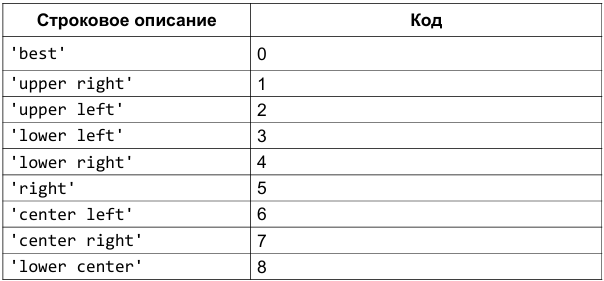
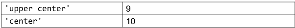
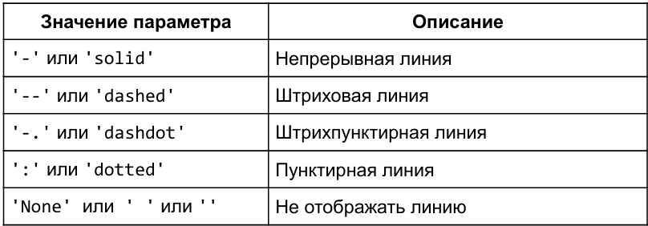

# Тетрадка по "matplotlib"
## Представление графиков на разных полях
- figure() - функция для задания глобальных параметров отображения графиков. В нее, в качестве аргумента, мы передаем кортеж, определяющий размер общего поля.
``` python 
plt.figure(figsize=(x, y)) 
```
- subplot() - функция для задания местоположения поля с графиком. Существует несколько способов задания областей для вывода графиков. В примере мы воспользовались вариантом, который предполагает передачу трех аргументов: первый аргумент- количество строк, второй - столбцов в формируемом поле, третий- индекс (номер поля, считаем сверху вниз, слева направо).
``` python
plt.subplot(2, 1, 2)
```
## Построение диаграммы для категориальных данных
``` python
fruits = ['apple', 'peach', 'orange', 'bannana', 'melon']
counts = [34, 25, 43, 31, 17]
plt.bar(fruits, counts)
```
- ``` fruits ``` - создание имен будущих столбцов диаграммы
- ```counts``` - создание числовых значений относящихся к именнам ```fruits```
- ```plt.bar(fruits, counts)``` - построение самой диаграммы по имеющимся данным
## Подписи 
- За размещение текста на поле графика отвечает функция text(), которой первым и вторым аргументами передаются координаты позиции надписи, после - текст самой надписи:
``` python
plt.text(x, y, 'text')
```
- Легенда будет размещена на графике, если вызвать функцию legend(), Перед этим нужно подписать ```plot```'ы с помощью ```label='name'```
``` python
plt.plot(x, y, label='name')
plt.legend()
```
### Расположение легенды


- расположение в деле смотерть в уроке 3.1 в ```readme```
## Таблица со стилями линии линейного графика

- Указывать их как параметр ```plot```'а
``` python
plt.plot(x, y, '--r')
# Стиль линий вместо '--'
# r - это цвет (крассный) линий который можно также свободно менять
```
## Другое
- Учебник:  
https://evil-teacher.on.fleek.co/books/prog_pm/matplotlib.pdf
