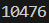
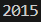
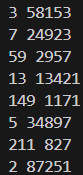

# Лабораторная работа №6 | Вариант 1
## Условия задач
### Задание 1
 Тимофей составляет 5-буквенные коды из букв Т, И, М,О, Ф, Е, Й. Буква Й может использоваться в коде не более одного раза, при этом она не может стоять на первом месте, на последнем месте и рядом с буквой И Все остальные буквы могут встречаться произвольное количество раз или не встречаться совсем. Сколько различных кодов может составить Тимофей?

**Решение:**
``` python
from itertools import *
name='ТИМОФЕЙ'
comb=product(name, repeat=5)
scet=0
for i in comb:
    if ''.join(i).count('Й')<=1 and\
        i[0]!='Й' and i[4]!='Й' and\
        i[0]+i[1]!='ИЙ' and i[1]+i[2]!='ИЙ' and\
        i[2]+i[3]!='ИЙ' and\
        i[1]+i[2]!='ЙИ' and i[2]+i[3]!='ЙИ' and\
        i[3]+i[4]!='ЙИ':
            scet+=1
print(scet)
```
**Результат:**


### Задание 2
Сколько единиц содержится в двоичной записи значения выражения $4^{2020}+2^{2017}-15$?

**Решение:**
```python
print(bin(4**2020+2**2017-15)[2:].count('1'))
```
**Результат:**


### Задание 3
Найдите среди целых чисел, принадлежащих числовому отрезку 
$[174457; 174505]$, числа, имеющие ровно два различных натуральных делителя, не считая единицы и самого числа. Для каждого найденного числа запишите эти два делителя в два соседних столбца на экране с новой строки в порядке возрастания произведения этих двух делителей. Делители в строке также должны следовать в порядке возрастания. Например, в диапазоне $[5; 9]$ ровно два различных натуральных делителя имеют числа 6 и 8, поэтому для этого диапазона вывод на экран должен содержать следующие значения:
``` 
2 3
2 4 
```
**Решение:**
```python
for i in range(174457, 174505+1):
    d = []
    for j in range(2, i//2 + 1):
        if i % j == 0:
            d.append(j)
        if len(d) > 2:
            break
    if len(d) == 2:
        print(d[0], d[1])
```
**Результат:**


