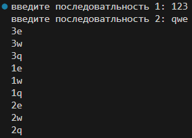

# Лабораторная работа №9 | вариант 4
## Задание
1) Решите задачу своего варианта.
2) Оформите отчёт в README.md. Отчёт должен содержать:
    - Условия задач
    - Описание проделанной работы
    - Скриншоты результатов
    - Ссылки на используемые материалы
### Задание варианта
Генератор, создающий все возможные уникальные комбинации элементов из нескольких последовательностей.
## Проделанная работа 
``` python
def generator(pos1, pos2):
    for i in pos1:
        for j in pos2:
            result=i+j
            yield result

pos=input("введите последоватльность 1: ")
pos1=set(pos)
pos=input("введите последоватльность 2: ")
pos2=set(pos)
otvet=generator(pos1,pos2)
for i in otvet:
    print(i)
```

## Скриншоты результатов
