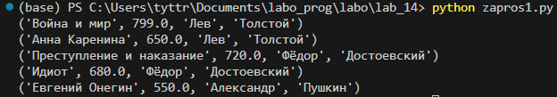
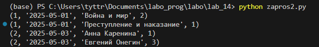
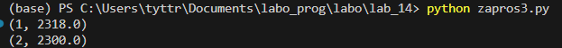

# Лабораторная работа №14 | Вариант 9
## Задание 
1) Спроектируйте БД с использованием crow’s foot notation.
2) Создайте таблицы БД и заполните данными. Для генерации данных можно использовать сервис https://www.mockaroo.com/.
3) Напишите несколько запросов для выборки данных из всех таблиц.
4) Оформите отчёт в README.md. Отчёт должен содержать:
    * Условия задач
    * Описание проделанной работы
    * Скриншоты результатов
    * Ссылки на используемые материалы
### Задание варианта
9) База данных для учета книг в книжном магазине:
    * Таблица Книги с информацией о книгах в магазине, такой как название, автор и цена.
    * Таблица Авторы с информацией об авторах книг, например, их имена и биографии.
    * Таблица Заказы с информацией о заказах книг, такой как дата заказа и статус доставки.
## Проделанная работа
### Crow’s foot notation

### База данных

### Запрсоы
1) Все книги с именами авторов:

2) Заказы и книги в них:

3) Сумма каждого заказа:

## Использованные материалы
https://dbdiagram.io/d