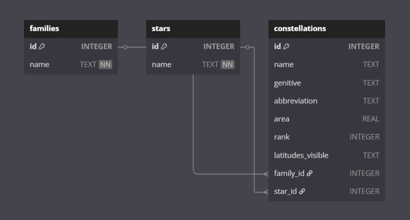
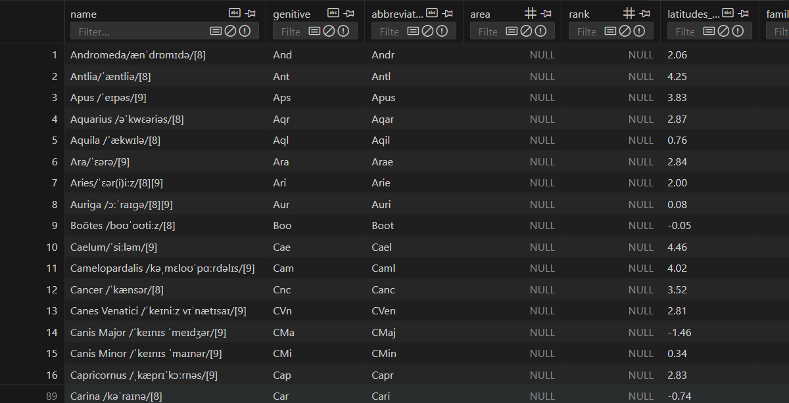
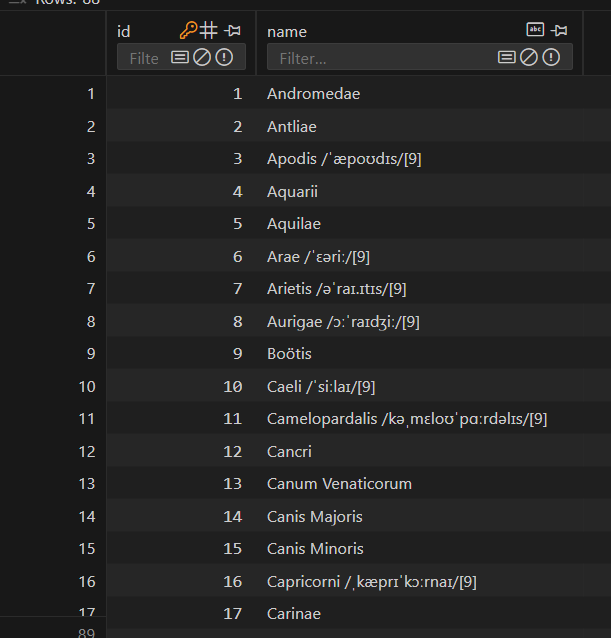
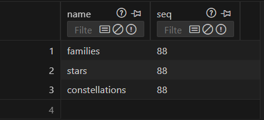
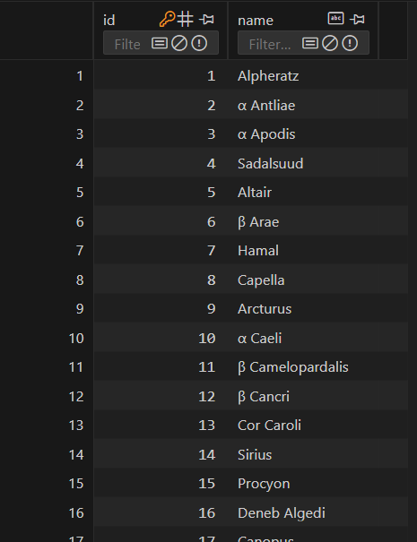
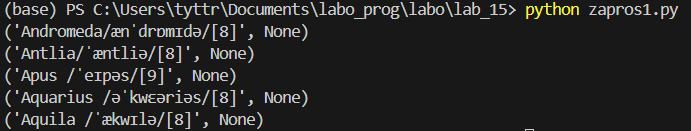
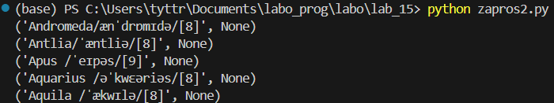
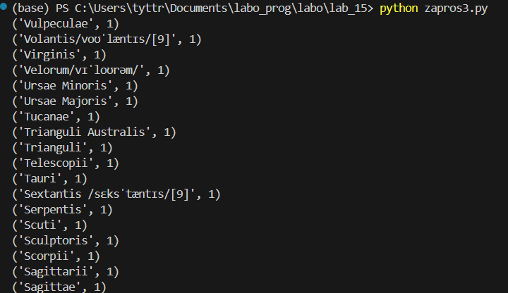
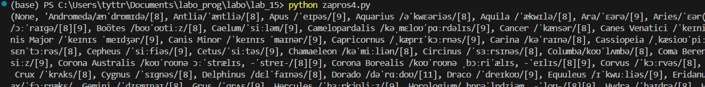

# Лабораторная работа №15 | Вариант 9
## Задание 
1) Спроектируйте БД с использованием crow’s foot notation.
2) Реализуйте парсер для сбора данных с веб-страницы.
3) С помощью DB API cоздайте таблицы БД и заполните их данными, полученными с помощью парсера.
4) Напишите запросы для выборки данных из БД.
5) Оформите отчёт в ```README.md```. Отчёт должен содержать:
    * Условия задач
    * Описание проделанной работы
    * Скриншоты результатов
    * Ссылки на используемые материалы
### Задание варианта
9) Список созвездий по площади.
- Таблицы:
    * созвездие
    * группа
    * область
- Запросы:
    * топ N больших/маленьких по площади в кв. градусах
    * топ N больших/маленьких по площади в процентах
    * созвездия с группировкой по группам
    * созвездия с группировкой по областям
## Проделанная работа
- Для создания базы данных сначала запускаем файл ```parsing.py```, а потом файл ```goodbd.py```.
### Crow’s foot notation

### База данных
1) 
2) 
3) 
4) 
### Запросы
#### 1-ый [Топ N больших созвездий по площади (в кв. градусах)]
```sql
SELECT name, area
FROM constellations
ORDER BY area DESC
LIMIT 5;
```

и т.д.
#### 2-ой [Топ N маленьких созвездий по площади (в кв. градусах)]
```sql
SELECT name, area
FROM constellations
ORDER BY area ASC
LIMIT 5;
```

#### 3-ий [Созвездия с группировкой по группам]
```sql
SELECT f.name AS family_name, COUNT(c.id) AS count
FROM constellations c
LEFT JOIN families f ON c.family_id = f.id
GROUP BY f.name
ORDER BY count DESC;
```

и т.д.
#### 4-ый [Созвездия с группировкой по областям]
```sql
SELECT rank, GROUP_CONCAT(name, ', ') AS constellations
FROM constellations
GROUP BY rank
ORDER BY rank;
```

и т.д.