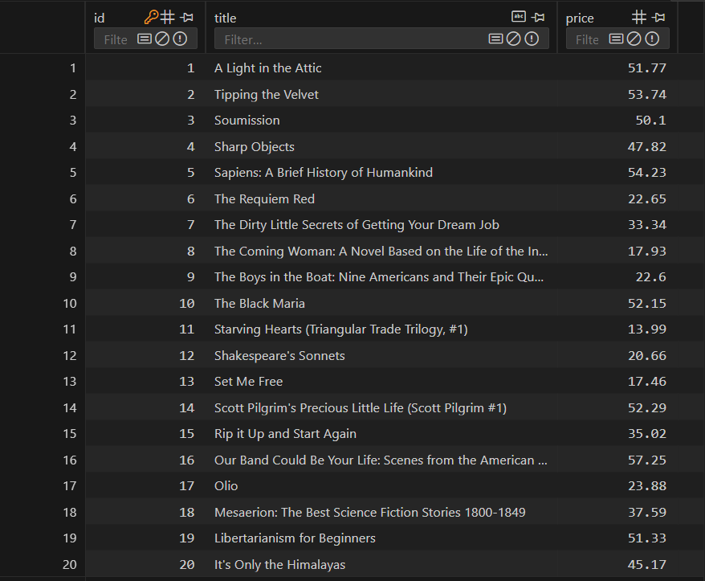
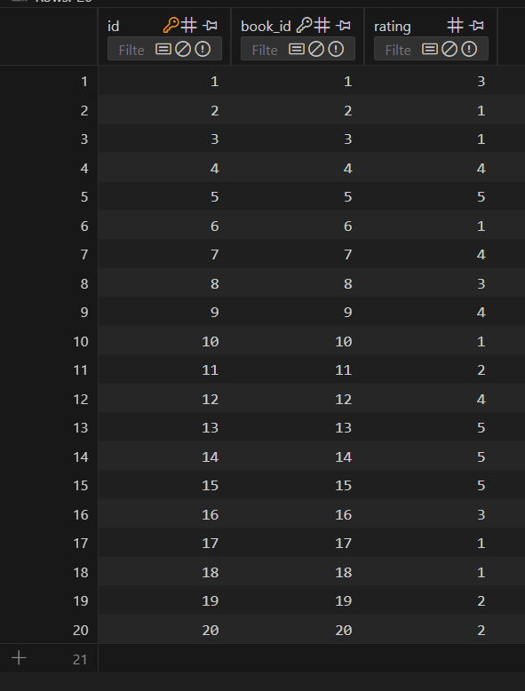
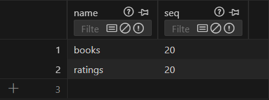
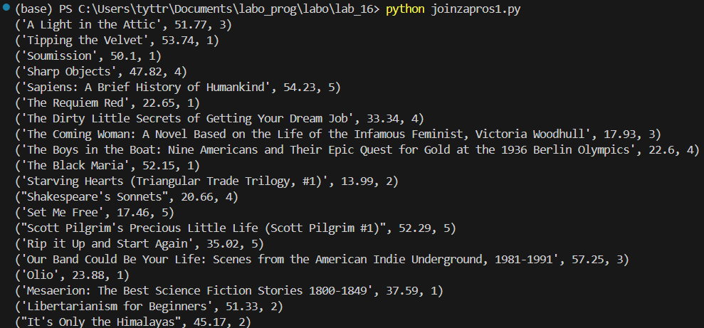
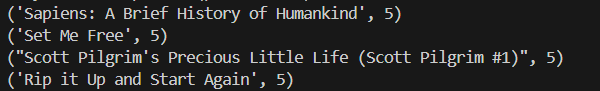
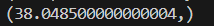
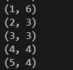
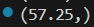

# Лабораторная работа №16 | Сайт с книгами
## Задание 
1) Реализуйте парсер с использованием Selenium для сбора данных с веб-страницы. Это может быть:
    - онлайн-каталог
    - интернет-магазин
    - энциклопедия и т.д.
**Основное требование:** чтобы ресурсы не повторялись внутри группы, т.е. все должны парсить разные сайты.

2) Создайте таблицы БД и заполните их данными, полученными с помощью парсера. У вас должно быть **минимум 2** таблицы. При заполнении в запросах используйте именованные плейсхолдеры драйвера вашей СУБД.
3) Напишите запросы для выборки данных из БД с использованием ***PyPika Query Builder***. У вас должно быть:
    - 2 запроса с JOIN
    - 3 запроса с расчётом статистики/группировкой/агрегирующими функциями
4) Оформите отчёт в README.md. Отчёт должен содержать:
    - Условия задач
    - Описание проделанной работы
    - Скриншоты результатов
    - Ссылки на используемые материалы
## Проделанная работа
### База данных заполненая парсером:
1) 
2) 
3) 
### Запросы:
1) Выбрать все книги с их рейтингами:
``` python 
q = Query.from_(books).join(ratings).on(books.id == ratings.book_id).select(books.title, books.price, ratings.rating) 
```
Результат:



2) Выбрать книги с рейтингом 5
``` python
q = Query.from_(books).join(ratings).on(books.id == ratings.book_id).select(books.title, ratings.rating).where(ratings.rating == 5)
```
Результат:



3) Средняя цена книг
``` python
q = Query.from_(books).select(fn.Avg(books.price).as_("avg_price"))
```
Результат:



4) Кол-во книг по каждому рейтингу (группировка):
``` python
q = Query.from_(ratings).select(ratings.rating, fn.Count(ratings.id).as_("count")).groupby(ratings.rating)
```
Результат:



5) Максимальная цена книги с рейтингом >= 3:
``` python
q = Query.from_(books).join(ratings).on(books.id == ratings.book_id).select(fn.Max(books.price).as_("max_price")).where(ratings.rating >= 3)
```
Результат:

