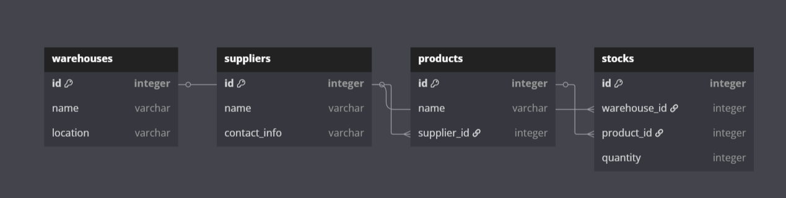
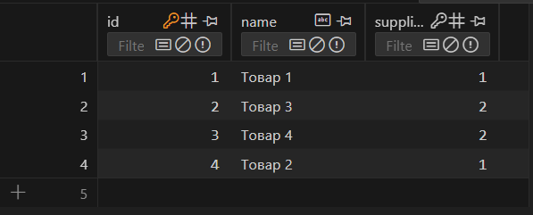
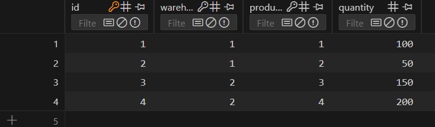
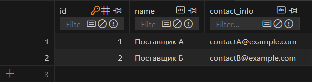
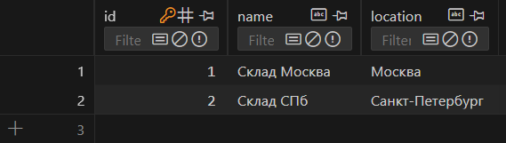
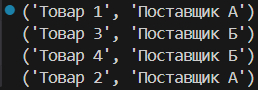
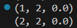
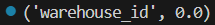
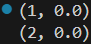

# Лабораторная работа №17 | Вариант 9
## Задание 
1) Спроектируйте БД с использованием ```crow’s foot notation```.
2) Напишите модели данных, создайте и заполните БД с помощью ```SQLAlchemy```.
3) Напишите запросы для выборки и анализа данных из БД.
4) Оформите отчёт в README.md. Отчёт должен содержать:
    - Условия задач
    - Описание проделанной работы
    - Скриншоты результатов
    - Ссылки на используемые материалы
### Задание варината
Склады. На каждом складе может храниться некоторое количество различных товаров, у каждого товара должен быть единственный поставщик.
## Проделанная работа:
### Crow’s foot notation

### База данных
1) 
2) 
3) 
4) 
### Запросы
1) Товары на складах и поставщики:
``` python
q = Query.from_(products).join(suppliers).on(products.supplier_id == suppliers.id).select(products.name, suppliers.name)
```
Результат:



2) Количество товаров на каждом складе:
``` python
q = Query.from_(products).groupby(products.supplier_id).select(products.supplier_id, fn.Count("*"), fn.Sum(products.quantity))
```
Результат:



3) Средняя цена товаров:
``` python
q = Query.from_(products).groupby(products.warehouse_id).select(products.warehouse_id, fn.Sum(products.quantity))
```
Результат:



4) Общая стоимость товаров у каждого поставщика:
``` python
q = Query.from_(products).groupby(products.supplier_id).select(products.supplier_id, fn.Avg(products.price))
```
Результат:


