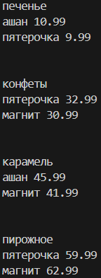

# Лабораторная работа №4
## Задание 00
Составить словарь словарей расстояний между городами

**Результат:**

## Задание 01
Вычислить площадь круга. Вывести на экран с точностью 4 знака после запятой. Вывести, входят ли точки в круг (2 точки)

**Результат:**

## Задание 02
Расставьте знаки операций "плюс", "минус", "умножение" и скобки между числами "1 2 3 4 5" так, что бы получилось число "25"

**Результат:**

## Задание 03
Выведите на консоль с помощью индексации строки, последовательно:
- первый фильм
- последний
- второй
- второй с конца

**Результат:**

## Задание 04
Создать списки членов семьи и их роста. Вывести рост отца и сумму роста членов семьи

**Результат:**

## Задание 05
- посадите медведя (bear) между львом и кенгуру и выведите список на консоль
- добавьте птиц из списка birds в последние клетки зоопарка и выведите список на консоль
- уберите слона и выведите список на консоль
- выведите на консоль в какой клетке сидит лев и жаворонок.
-Номера при выводе должны быть понятны простому человеку, не программисту.

**Результат:**

## Задание 06
- Распечатайте общее время звучания трех песен: 'Halo', 'Enjoy the Silence' и 'Clean' в формате "Три песни звучат ХХХ.XX минут"
- распечатайте общее время звучания трех песен: 'Sweetest Perfection', 'Policy of Truth' и 'Blue Dress': "А другие три песни звучат ХХХ минут"

**Результат:**

## Задание 07
Нужно расшифровать сообщение и вывести на консоль в удобочитаемом виде.

**Результат:**

## Задание 08
- создайте множество цветов, произрастающих в саду и на лугу
- выведите на консоль все виды цветов
- выведите на консоль те, которые растут и там и там
- выведите на консоль те, которые растут в саду, но не растут на лугу
- выведите на консоль те, которые растут на лугу, но не растут в саду

**Результат:**

## Задание 09
Вывести надо только по 2 магазина с минимальными ценами

**Результат:**

## Задание 10
- Вывести стоимость каждого вида товара на складе и общую цену

**Результат:**

