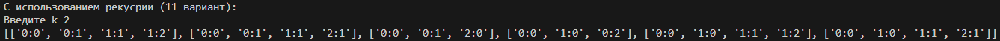
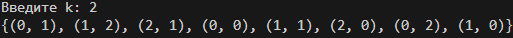
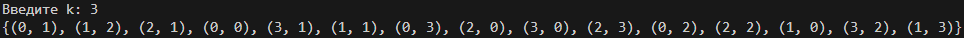
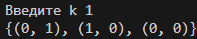
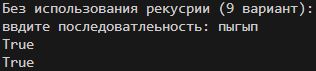
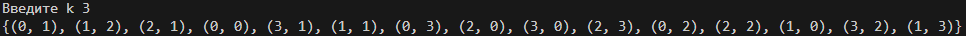
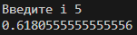
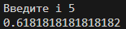

# Лабораторная работа №7 | Вариант 11
## Задание
1) Напишите две функции для решения задач своего варианта - с использованием рекурсии и без.
2) Оформите отчёт в README.md. Отчёт должен содержать:
    - Условия задач
    - Описание проделанной работы
    - Скриншоты результатов
    - Ссылки на используемые материалы
### Задание варианта 
1) Функция, возвращающая все возможные результаты спортивных матчей с разницей в ```k```
2) Функция для вычисления
$$
x_i = \frac{x_{i-1} + 1}{x_{i-1} + 2},x_0 = 1.
$$
## Опсиание проделанной работы
### №1
#### **Решение с рекурсией**
``` python
def recursion():
    def f(one, two, k, mn):
        mn.add((one, two))
        if one==k or two==k: return 0
        f(one+1, two, k, mn)
        f(one, two+1, k, mn)
    one = 0
    two = 0
    k = int(input("Введите k: "))
    mn = set()
    f(one, two, k, mn)
    print(mn)
```
**Результаты:**





#### **Решение без рекурсии**
``` python
def norecursion():
    one=0
    two=0
    result=set()
    k=int(input("Введите k "))
    for one in range (k+1):
        for two in range(k+1):
            if (one==k and two==k):
                continue
            result.add((one,two))
        if (one==k and two==k):
            continue
        result.add((one,two))
    print(result)
```
**Результаты:**




### №2
#### **Решение с рекурсией**
``` python
def recursion():
    def x(i):
        if i==0: return 1
        return (x(i-1)+1)/(x(i-1)+2)
    i=int(input("Введите i "))
    print(x(i))
```
**Результат:**


#### **Решение без рекурсии**
``` python
def norecursion():
    i=int(input("Введите i "))
    x=1
    if i!=0:
        for a in range(x,i):
            x=(x+1)/(x+2)
    print(x)
```
**Результат:**


